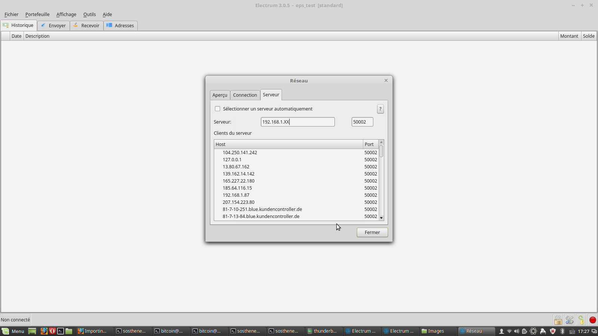
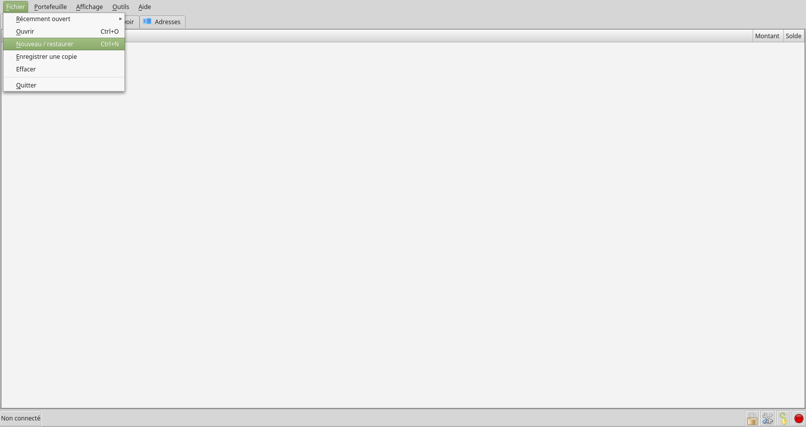
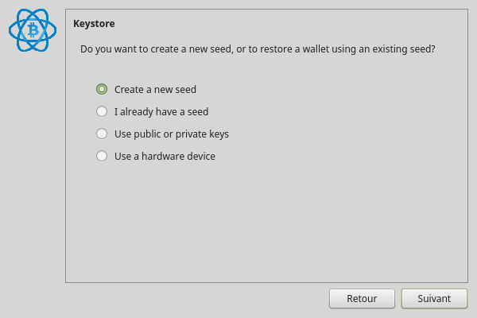
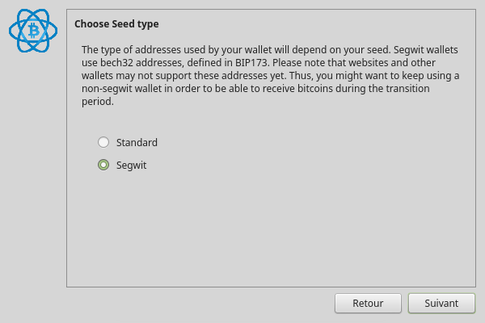
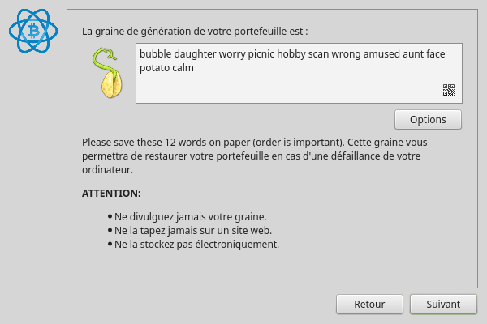
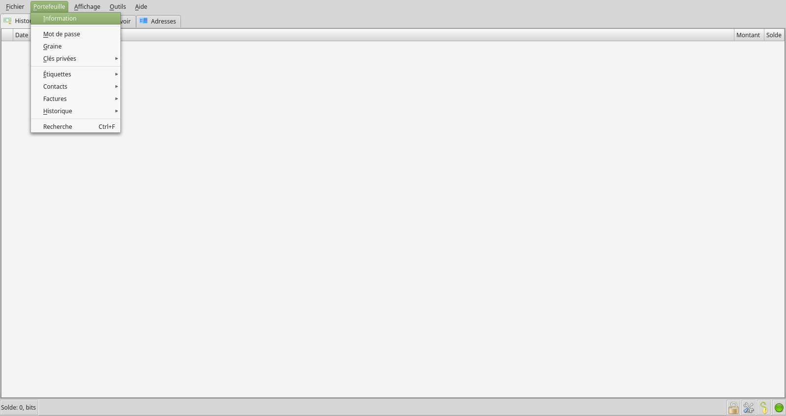
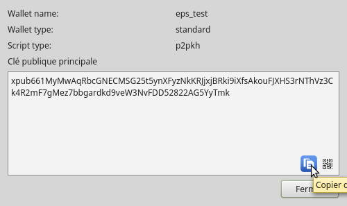

[ [Intro](README.md) ] -- [ [Préparatifs](thunderbadger_10_preparations.md) ] -- [ [Thunder Badger](thunderbadger_20_ThunderBadger.md) ] -- [ [Bitcoin](thunderbadger_30_bitcoin.md) ] -- [ [LND](thunderbadger_40_lnd.md) ] -- [ [Mainnet](thunderbadger_50_mainnet.md) ] -- [ **Bonus** ]

------

### Thunder Badger : un nœud Bitcoin et ⚡Lightning️⚡ dans votre vieux portable pourri !

------

## Bonus : Electrum Personal Server

*Difficulté: moyenne*

### Introduction

Le meilleur moyen de conserver vos bitcoins avec un bon compromis entre sécurité et accessibilité est d'utiliser un portefeuille _matériel_ (_hardware wallet_), comme [Ledger](https://www.ledgerwallet.com/) ou [Trezor](https://trezor.io/) en combinaison de votre nœud Bitcoin. En faisant ainsi, vous éliminez le besoin de passer par un tiers pour vérifier vos transactions.

Bien que rien ne vous empêche d'utiliser l'interface graphique avec votre Thunder Badger, dans la pratique cela sera souvent pénible. Bitcoin Core ne supporte pas à l'heure actuelle les portefeuilles matériels. Avec votre nœud, vous ne pouvez donc qu'utiliser par défaut un portefeuille _chaud_, c'est à dire exposé sur internet. 

Une possibilité pour profiter d'une interface graphique plus agréable et du support d'un portefeuille matériel serait d'installer un serveur [ElectrumX](https://github.com/kyuupichan/electrumx) sur le Thunder Badger et [Electrum](https://electrum.org/) sur votre ordinateur habituel. Cela peut toutefois s'avérer assez complexe, et pourrait également être trop gourmand pour les possibilités sans doute assez limitées du Thunder Badger.

[Electrum Personal Server](https://github.com/chris-belcher/electrum-personal-server) vous permet de connecter Electrum (et avec lui votre portefeuille matériel) directement au Thunder Badger. Contrairement à ElectrumX, ce n'est pas un serveur destiné à répondre aux requêtes de multiples utilisateurs, mais uniquement aux vôtres.

### Installer Electrum

Sur votre ordinateur habituel, commencez par installer Electrum.

* Télécharger l'[installer Windows](https://download.electrum.org/3.2.3/electrum-3.2.3-setup.exe)  

* Lancer l'exécutable et suivez les instructions

* Une fois Electrum installé, lancez-le

* Cliquer sur la petite boule verte (ou rouge) en bas à droite de l'écran. Une fenêtre s'ouvre, dans l'onglet "serveur", décocher la case "sélectionner un serveur automatiquement" et dans le champ en-dessous saisissez l'adresse IP locale du Thunder Badger, par exemple `192.168.1.20`.  



* Cliquer sur `Fichier`, puis `Nouveau/Restaurer`  

  

* Dans la fenêtre de création de portefeuille, donner un nom au portefeuille (par exemple, `thunder badger`), et sélectionner ensuite "Standard wallet", puis "create a new seed"



* Dans la fenêtre suivante, sélectionner "segwit"



* Une liste de mots apparaît, il s'agit de la _seed_ de votre portefeuille. Si jamais vous perdiez l'accès à votre portefeuille (destruction de votre ordinateur par exemple), la seed vous permettra de retrouver votre portefeuille et toutes ses transactions. **Cela signifie également que quiconque possède cette information peut voler tout ce que contient votre portefeuille !** Recopiez-la sur une feuille de papier, **ne prenez pas de photos avec votre téléphone, ne l'enregistrez pas sous forme électronique.** 



* Saisissez à nouveau votre seed... votre portefeuille est créé

### Installer Electrum Personal Server

* Depuis votre ordinateur habituel, ouvrir une session via SSH avec l'utilisateur "bitcoin"  
  `$ ssh bitcoin@[VOTRE_IP]`  
* Télécharger, vérifier et extraire la dernière release (voir [cette page](https://github.com/chris-belcher/electrum-personal-server/releases) pour vérifier quelle est la plus récente et obtenir le bon lien)  

  ```
  # créer un nouveau répertoire
  $ mkdir electrum-personal-server
  $ cd electrum-personal-server
  
  # télécharger le code et les signatures
  $ wget https://github.com/chris-belcher/electrum-personal-server/archive/eps-v0.1.7.tar.gz
  $ wget https://github.com/chris-belcher/electrum-personal-server/releases/download/electrum-personal-server-v0.1.7/electrum-personal-server-v0.1.7.tar.gz.asc
  $ wget https://raw.githubusercontent.com/chris-belcher/electrum-personal-server/master/pgp/pubkeys/belcher.asc
  
  # vérifier la signature de Chris Belcher et l'intégrité du fichier téléchargé
  $ gpg belcher.asc
  > 0A8B038F5E10CC2789BFCFFFEF734EA677F31129
  
  $ gpg --import belcher.asc
  $ gpg --verify electrum-personal-server-v0.1.7.tar.gz.asc
> gpg: Signature made ven. 26 avril 2019 18:08:13 CEST
> gpg:                using RSA key EF734EA677F31129
> gpg: Good signature from "Chris Belcher <false@email.com>" [unknown]
> gpg: WARNING: This key is not certified with a trusted signature!
> gpg:          There is no indication that the signature belongs to the owner.
  
  # Décompresser le fichier
  $ tar -xvf electrum-personal-server-v0.1.7.tar.gz    
```
* Créer un environnement virtuel Python
```
# entrer dans le nouveau dossier
  $ cd electrum-personal-server-v0.1.7

# créer et activer l'environnement virtuel
  $ python3 -m venv venv
  $ . venv/bin/activate
```

* Installer electrum personal server
```
  $ python setup.py build
  $ python setup.py install
```
* Faire une copie du fichier de configuration ; l'ouvrir  
```
  $ cp config.ini_sample config.ini
  $ nano config.ini 
```
  * Ajouter la clé publique principale du portefeuille Electrum, ou les adresses en lecture seule (_watch only_) à suivre dans les sections `[master-public-keys]` et `[watch-only-addresses]`. La clé publique principale d'un portefeuille Electrum se trouve dans `Portefeuille` -> `Information`.
  
    
    
  
  * Remplacer la ligne suivante  
  `#any_name_works = xpub661...`
  
  * ...par la clé publique que vous avez copiée dans Electrum. Ne pas oublier de retirer le `#`.

  * Activer les lignes suivantes en suppriment le `#`, et ajouter vos propres données d'identification  
    `rpc_user = [IDENTIFIANT]`  
    `rpc_password = [MOT_DE_PASSE]`

  * Changer la ligne `host` de la section `[electrum-server]` en `0.0.0.0`. À noter que pour des raisons de sécurité, vous ne pourrez vous connecter que depuis votre réseau privé  
    `host = 0.0.0.0`  
  * Bien que cela ne soit pas obligatoire, je vous recommande fortement de restreindre la connexion à l'adresse IP de votre ordinateur sur votre réseau local. Pour cela, il faudra d'abord configurer une adresse IP statique comme vous l'avez déjà fait pour [le Thunder Badger](https://github.com/BobleChinois/guides/blob/master/thunderbadger/thunderbadger_20_ThunderBadger.md#adresse-ip-fixe), puis ajouter cette adresse à la place de `*` à la ligne `ip_whitelist`.  
  `ip_whitelist = 192.168.1.XX` (souvenez-vous c'est bien l'adresse IP **locale** dont nous avons besoin ici)
  
* Sauvegarder et quitter

* Ouvrir le bon port dans ufw
```
# Basculer sur votre utilisateur admin
$ su admin

# Ajouter une règle dans le firewall ufw (n'oubliez pas de mettre l'adresse IP statique définie au-dessus !)
$ sudo ufw allow from 192.168.1.XX to any port 50002  comment 'allow EPS'

# Redémarrer ufw pour activer les modifications
$ sudo systemctl restart ufw.service

# Quitter la session admin
$ exit
```

### Premier lancement

* Démarrer le serveur 
  `$ electrum-personal-server config.ini`

### Vérifier la connexion du portefeuille Electrum

Ouvrez Electrum, le point en bas à droite de l'écran devrait maintenant être vert, ce qui signifie que vous êtes connecté avec votre Thunder Badger. Si vous avez utilisé un portefeuille déjà existant, les transactions antérieures devraient apparaître à l'écran.

### Don't trust, verify.

Félicitations, vous avez désormais le meilleur portefeuille Bitcoin possible. Ajoutez-y un portefeuille matériel, et vous aurez un excellent compromis entre sécurité, confidentialité et ergonomie !

---

<< Back: [Bonus](thunderbadger_60_bonus.md) 
